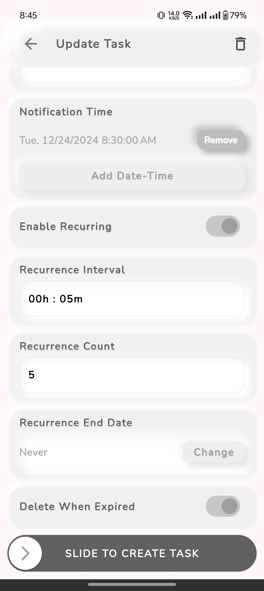

# Remind Me

Remind Me is a Flutter app designed to help users stay organized and on schedule. It provides powerful features for scheduling and managing tasks, with automatic cleanup of completed or unwanted tasks. The app also supports recurring tasks with full control over repetition intervals, ensuring a highly customizable and user-friendly experience.

## Features

- **Task Reminders**: Set reminders for specific tasks to ensure you never miss a deadline.
- **Recurring Tasks**: Schedule tasks to repeat at custom intervals (e.g., daily, weekly, or custom timeframes)
- **Automatic Cleanup**: Unwanted or expired tasks are automatically removed for a clutter-free experience.
- **Custom Schedules:**: Fine-tune scheduling and notification times for precise task management.

## Screenshots

  
  

  
  

  
  

