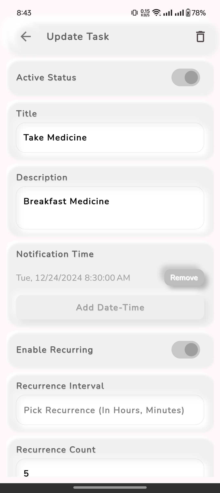

# Remind Me 🔔

A beautiful, feature-rich Flutter app designed to help users stay organized and on schedule. Remind Me combines powerful task management with an elegant alarm system, providing a comprehensive solution for personal productivity and time management.

## ✨ Features

### 📝 Advanced Task Management
- **Smart Task Creation**: Intuitive form-based task creation with comprehensive validation
- **Multiple Notification Times**: Set multiple reminder times for each task with date/time picker
- **Flexible Recurring Tasks**: Custom recurrence intervals (hours, minutes) with optional end dates
- **Task Lifecycle Management**: Active/inactive status with automatic background cleanup
- **Auto-Delete Options**: Configure tasks to auto-delete when expired
- **Rich Task Details**: Title, description, and multiple notification times per task

### 🔔 Professional Alarm System
- **Full-Screen Alarm Interface**: Stunning fullscreen alarm with time display and smooth animations
- **Notification Integration**: Tap notifications to open alarm screen directly
- **Background Processing**: Reliable alarm system that works when app is closed or device restarts
- **Audio & Vibration**: Customizable alarm sounds with optional vibration feedback
- **Cross-Platform Support**: Full Android and iOS compatibility with platform-specific optimizations
- **Smart Alarm Handling**: Dismiss and snooze functionality with proper state management

### 🎨 Enhanced User Experience
- **Dynamic Dark/Light Themes**: Beautiful gradient backgrounds with automatic theme switching
- **Responsive Design**: Optimized layouts for all screen sizes and orientations
- **Smooth Animations**: Polished transitions, micro-interactions, and gesture-based controls
- **Intuitive Navigation**: Clean interface with clear visual hierarchy and accessibility
- **Form Validation**: Real-time validation with helpful error messages and user guidance

### ⚙️ Comprehensive Settings
- **Theme Management**: Toggle between dark and light themes with instant switching
- **Notification Controls**: Enable/disable push notifications, sound, and vibration
- **Language Support**: Multi-language interface (expandable)
- **App Information**: Version info, privacy policy, terms & conditions, contact details
- **Legal Compliance**: Built-in links to privacy policy and terms of service

### 🔧 Technical Excellence
- **Robust Background Services**: Hourly background task processing with timezone-aware scheduling
- **Advanced Local Storage**: Hive-based offline data persistence with automatic serialization
- **Smart Notification System**: Advanced notification handling with actions and deep linking
- **Timezone Intelligence**: Proper timezone handling (Asia/Dhaka) for accurate global scheduling
- **Comprehensive Testing**: Unit tests, integration tests, and manual verification scripts
- **Error Handling**: Graceful error management with detailed logging and user feedback

## 📱 Screenshots

### Main Interface
<p align="center">
  
  
  
</p>

### Alarm & Notifications
<p align="center">
  
  
  
</p>

### Key Features Showcase
- **Home Screen**: Clean task list with active/inactive status indicators
- **Task Creation**: Comprehensive form with date/time pickers and recurrence options
- **Settings**: Complete app configuration including themes, notifications, and legal info
- **Alarm Screen**: Professional fullscreen alarm with dismiss/snooze controls
- **Notifications**: Rich notifications with direct action buttons
- **Themes**: Beautiful dark/light theme support with gradient backgrounds

## 🚀 Recent Updates & Fixes

### Latest Improvements (v1.0.0)
- ✅ **Fixed Background Task Issues**: Resolved timezone mismatch causing expired tasks to remain active
- ✅ **Enhanced Alarm System**: Improved notification tap handling and fullscreen alarm interface
- ✅ **Settings Screen**: Added comprehensive app settings with theme toggle and notification controls
- ✅ **UI/UX Fixes**: Resolved scrolling issues in task creation and improved form validation
- ✅ **Testing Infrastructure**: Implemented robust unit tests and manual verification scripts
- ✅ **Code Quality**: Enhanced error handling, logging, and background service reliability

### Key Technical Fixes
- **Timezone Handling**: Fixed initialization order to prevent background service timezone issues
- **Background Processing**: Improved hourly task cleanup with proper error recovery
- **Notification Integration**: Enhanced deep linking from notifications to alarm screen
- **Theme Management**: Implemented persistent theme switching with beautiful gradients
- **Form Validation**: Added comprehensive validation with user-friendly error messages

### Performance Enhancements
- **Background Service Optimization**: Reduced resource usage and improved reliability
- **Database Operations**: Optimized Hive operations for better performance
- **Memory Management**: Proper disposal of controllers and listeners
- **UI Responsiveness**: Improved scrolling and animation performance

## 🚀 Getting Started

### Prerequisites
- Flutter SDK (3.22.0 or higher)
- Dart SDK (3.0.0 or higher)
- Android Studio / Xcode for platform-specific development

### Installation

1. **Clone the repository**
   ```bash
   git clone https://github.com/yourusername/remind_me.git
   cd remind_me
   ```

2. **Install dependencies**
   ```bash
   flutter pub get
   ```

3. **Run the app**
   ```bash
   flutter run
   ```

### Platform Setup

#### Android
- Ensure `compileSdk` is set to 35 in `android/app/build.gradle`
- Add necessary permissions in `AndroidManifest.xml`
- For alarm functionality, grant exact alarm permissions

#### iOS
- Add background capabilities in Xcode
- Configure notification permissions
- Set up audio session for alarm sounds

## 🏗️ Architecture

### Core Services
- **NotificationService**: Advanced local notifications with actions and deep linking
- **HiveService**: Robust data persistence with automatic adapters and boxes
- **WorkmanagerService**: Background task processing with timezone-aware scheduling
- **ThemeProvider**: Dynamic theme management with ChangeNotifier pattern

### Key Components
- **HomeScreen**: Main task dashboard with list view and navigation
- **CreateTaskScreen**: Multi-step task creation with validation and form controls
- **AlarmScreen**: Fullscreen alarm interface with time display and controls
- **SettingsScreen**: Comprehensive settings with theme toggle and preferences

### Background Processing
- **Flutter Background Service**: Persistent background execution for task cleanup
- **Timer-based Processing**: Hourly background task execution with error handling
- **Timezone-aware Scheduling**: Proper timezone handling for accurate time comparisons
- **Automatic Task Management**: Smart deactivation and deletion of expired tasks

### Data Layer
- **Hive Database**: Fast, lightweight NoSQL database for local storage
- **Task Entity**: Comprehensive task model with JSON serialization
- **Automatic Adapters**: Generated Hive adapters for seamless data persistence
- **Background Synchronization**: Real-time data updates across app components

## 🔧 Configuration & Settings

### Theme Management
- **Dynamic Themes**: Seamless switching between dark and light themes
- **Gradient Backgrounds**: Beautiful themed gradients for enhanced visual appeal
- **Persistent Settings**: Theme preferences saved across app sessions
- **System Integration**: Respects system theme preferences when available

### Notification & Alarm Settings
- **Push Notifications**: Enable/disable system-wide notifications
- **Sound Control**: Toggle notification sounds and alarm audio
- **Vibration**: Configure vibration feedback for alarms
- **Background Processing**: Control automatic task cleanup behavior

### Task Management Options
- **Auto-Delete**: Configure tasks to automatically delete when expired
- **Recurrence Settings**: Flexible recurrence intervals and end dates
- **Multiple Notifications**: Set multiple reminder times per task
- **Active Status**: Manual control over task activation/deactivation

### Notification Actions
- **Dismiss**: Immediately stop alarm and close notification
- **Snooze**: Pause alarm for 5 minutes with automatic rescheduling
- **Deep Linking**: Direct navigation from notifications to alarm screen
- **Background Support**: Actions work when app is closed or in background

## 📊 Data Management

### Task Entity Structure
```dart
class Task extends HiveObject {
  final String id;
  final String title;
  final String description;
  bool isActive;
  final List<DateTime> notificationTime;
  final bool deleteWhenExpired;
  final bool enableRecurring;
  final int? recurrenceCount;
  final int? recurrenceIntervalInSeconds;
  final DateTime? recurrenceEndDate;
  final bool enableAlarm; // New alarm functionality
}
```

### Storage & Persistence
- **Hive Database**: High-performance, lightweight NoSQL database
- **Automatic Adapters**: Generated Hive type adapters for seamless serialization
- **Box Management**: Organized storage with dedicated task boxes
- **Background Synchronization**: Real-time data updates and conflict resolution

### Background Task Processing
- **Automatic Cleanup**: Hourly background processing of expired tasks
- **Smart Logic**: Distinguishes between recurring and non-recurring tasks
- **Timezone Awareness**: Proper timezone handling for accurate scheduling
- **Error Recovery**: Comprehensive error handling with detailed logging
- **Performance Optimized**: Efficient batch processing with minimal resource usage

### Data Flow
1. **Task Creation**: Form validation → Hive storage → Notification scheduling
2. **Background Processing**: Timer trigger → Task analysis → Status updates
3. **Notification Handling**: Deep linking → Alarm screen → User interaction
4. **Theme Management**: Provider pattern → Real-time UI updates → Persistent storage

## 🎯 Usage Examples

### Creating a Task with Multiple Notifications
```dart
final task = Task(
  id: nanoid(), // Auto-generated unique ID
  title: 'Daily Standup Meeting',
  description: 'Team sync and progress update',
  isActive: true,
  deleteWhenExpired: false,
  notificationTime: [
    DateTime.now().add(Duration(hours: 1)),    // 1 hour before
    DateTime.now().add(Duration(minutes: 15)), // 15 minutes before
  ],
  enableRecurring: true,
  recurrenceCount: 30, // Daily for 30 days
  recurrenceIntervalInSeconds: 86400, // 24 hours
  recurrenceEndDate: DateTime.now().add(Duration(days: 30)),
  enableAlarm: true,
);

// Save to Hive database
final taskBox = Hive.box<Task>(taskBoxKey);
await taskBox.put(task.id, task);
```

### Background Task Processing
```dart
// Automatic background processing (runs every hour)
void backgroundTaskProcessor() {
  final currentTime = tz.TZDateTime.now(tz.local);
  final expiredTasks = taskBox.values.where((task) {
    return task.isActive && task.notificationTime
        .any((time) => time.isBefore(currentTime));
  });

  for (final task in expiredTasks) {
    if (task.deleteWhenExpired) {
      await taskBox.delete(task.id); // Auto-delete
    } else {
      task.isActive = false;
      await taskBox.put(task.id, task); // Deactivate
    }
  }
}
```

### Theme Management
```dart
// Using ThemeProvider for dynamic theming
class MyWidget extends StatelessWidget {
  @override
  Widget build(BuildContext context) {
    return Consumer<ThemeProvider>(
      builder: (context, themeProvider, child) {
        return Container(
          decoration: BoxDecoration(
            gradient: themeProvider.isDarkMode
                ? kDarkBackgroundGradient
                : kBackgroundGradient,
          ),
          child: Text(
            'Hello World',
            style: TextStyle(
              color: themeProvider.themeData.textTheme.bodyLarge?.color,
            ),
          ),
        );
      },
    );
  }
}
```

### Notification Handling
```dart
// Notification action handling
Future<void> onNotificationTap(String? payload) async {
  if (payload != null) {
    // Navigate to alarm screen with task details
    navigatorKey.currentState?.pushNamed(
      '/alarm',
      arguments: {'taskId': payload},
    );
  }
}

// Snooze functionality
void snoozeAlarm(String taskId) {
  final task = taskBox.get(taskId);
  if (task != null) {
    final snoozeTime = DateTime.now().add(Duration(minutes: 5));
    // Reschedule notification for snooze time
    NotificationService().scheduleNotification(
      id: taskId.hashCode,
      title: task.title,
      body: task.description,
      scheduledDateTime: snoozeTime,
      payload: taskId,
      enableAlarm: task.enableAlarm,
    );
  }
}
```

## 🔒 Permissions

### Android
- `POST_NOTIFICATIONS`: Display notifications
- `USE_EXACT_ALARM`: Precise alarm scheduling
- `VIBRATE`: Device vibration for alarms
- `FOREGROUND_SERVICE`: Background alarm service

### iOS
- `UNUserNotificationCenter`: Local notifications
- `AVAudioSession`: Audio playback for alarms
- Background processing capabilities

## 🐛 Troubleshooting

### Background Task Issues

**Tasks not being cleaned up automatically:**
- **Solution**: Ensure background service is running and timezone is properly configured
- **Check**: Look for background service logs in debug console
- **Verify**: Timezone should be set to 'Asia/Dhaka' for accurate scheduling

**Background service not starting:**
- **Android**: Check battery optimization and background service permissions
- **iOS**: Verify background processing capabilities in Xcode
- **Debug**: Look for "Background Service" logs in console

### Notification & Alarm Issues

**Alarms not firing on Android:**
- Check battery optimization settings (whitelist the app)
- Ensure `USE_EXACT_ALARM` permission is granted
- Verify Do Not Disturb settings don't block alarms
- Check notification channel configuration

**Notifications not showing:**
- Confirm notification permissions in app settings
- Check system notification settings for the app
- Verify notification channel is properly configured
- Ensure app is not in battery saver mode

**Alarm screen not opening from notification:**
- Verify notification action configuration
- Check deep linking setup in AndroidManifest.xml
- Ensure navigator key is properly configured

### UI & Performance Issues

**Form scrolling problems:**
- **Fixed**: Removed nested scroll views and improved keyboard handling
- **Solution**: SingleChildScrollView with proper padding and insets

**Theme switching not working:**
- **Check**: ThemeProvider is properly initialized in main.dart
- **Verify**: Consumer widgets are correctly implemented
- **Test**: Try restarting the app after theme changes

**Task creation validation errors:**
- **Common**: Ensure all dates are in the future
- **Check**: Form validation logic in CreateTaskScreen
- **Debug**: Look for validation error messages in console

### Data & Storage Issues

**Tasks not persisting:**
- **Check**: Hive initialization and adapter registration
- **Verify**: Box opening and error handling
- **Debug**: Look for Hive-related errors in console

**Corrupted task data:**
- **Solution**: Clear app data or reinstall
- **Prevention**: Proper error handling in data operations
- **Backup**: Consider implementing data export/import features

### Development & Testing

**Tests failing:**
- **Unit Tests**: Run `flutter test` to verify logic
- **Integration Tests**: Use `flutter test integration_test/` for full app testing
- **Manual Testing**: Run `dart test/manual_test_background_task.dart` for verification

**Build issues:**
- **Android**: Ensure compileSdk = 35 and proper permissions
- **iOS**: Configure background capabilities and notification permissions
- **Dependencies**: Run `flutter pub get` to resolve package issues

## 🤝 Contributing

We welcome contributions! Please follow these steps:

1. Fork the repository
2. Create a feature branch (`git checkout -b feature/amazing-feature`)
3. Commit your changes (`git commit -m 'feat: add amazing feature'`)
4. Push to the branch (`git push origin feature/amazing-feature`)
5. Open a Pull Request

### Development Guidelines
- Follow Flutter best practices and effective Dart guidelines
- Use conventional commit messages (feat, fix, docs, refactor, etc.)
- Add comprehensive tests for new features (unit + integration)
- Update documentation and README for any changes
- Ensure cross-platform compatibility (Android & iOS)
- Test background services and notification functionality
- Follow the existing code style and architecture patterns

### Testing Strategy
- **Unit Tests**: Test core logic in `test/background_task_unit_test.dart`
- **Integration Tests**: End-to-end testing (currently streamlined)
- **Manual Testing**: Run `dart test/manual_test_background_task.dart` for verification
- **Background Service Testing**: Verify timezone handling and task cleanup
- **UI Testing**: Test theme switching, form validation, and navigation

### Code Quality
- Use proper error handling and logging throughout
- Implement proper state management with Provider pattern
- Follow SOLID principles and clean architecture
- Add meaningful comments for complex business logic
- Ensure proper disposal of controllers and listeners

## 📄 License

This project is licensed under the MIT License - see the [LICENSE](LICENSE) file for details.

```
MIT License

Copyright (c) 2025 Pranta Dutta

Permission is hereby granted, free of charge, to any person obtaining a copy
of this software and associated documentation files (the "Software"), to deal
in the Software without restriction, including without limitation the rights
to use, copy, modify, merge, publish, distribute, sublicense, and/or sell
copies of the Software, and to permit persons to whom the Software is
furnished to do so, subject to the following conditions:

The above copyright notice and this permission notice shall be included in all
copies or substantial portions of the Software.

THE SOFTWARE IS PROVIDED "AS IS", WITHOUT WARRANTY OF ANY KIND, EXPRESS OR
IMPLIED, INCLUDING BUT NOT LIMITED TO THE WARRANTIES OF MERCHANTABILITY,
FITNESS FOR A PARTICULAR PURPOSE AND NONINFRINGEMENT. IN NO EVENT SHALL THE
AUTHORS OR COPYRIGHT HOLDERS BE LIABLE FOR ANY CLAIM, DAMAGES OR OTHER
LIABILITY, WHETHER IN AN ACTION OF CONTRACT, TORT OR OTHERWISE, ARISING FROM,
OUT OF OR IN CONNECTION WITH THE SOFTWARE OR THE USE OR OTHER DEALINGS IN THE
SOFTWARE.
```

## 🙏 Acknowledgments

- **Flutter Team**: For the amazing cross-platform framework
- **Hive Database**: For fast, reliable local data persistence
- **Flutter Background Service**: For robust background task processing
- **Flutter Local Notifications**: For advanced notification handling with actions
- **Timezone Package**: For accurate timezone-aware scheduling
- **Provider Package**: For efficient state management
- **All Contributors**: For their dedication to improving the Remind Me app

### Special Thanks
- Thanks to the Flutter community for excellent documentation and support
- Gratitude to beta testers for valuable feedback and bug reports
- Appreciation for users who trust Remind Me for their daily productivity

### Recent Improvements
- **Background Task Fixes**: Resolved timezone issues and improved reliability
- **UI/UX Enhancements**: Fixed scrolling issues and improved form validation
- **Settings Implementation**: Added comprehensive app configuration options
- **Testing Infrastructure**: Implemented robust unit and integration testing
- **Code Quality**: Enhanced error handling and logging throughout

---

**Made with ❤️ using Flutter - A comprehensive reminder and alarm solution**
